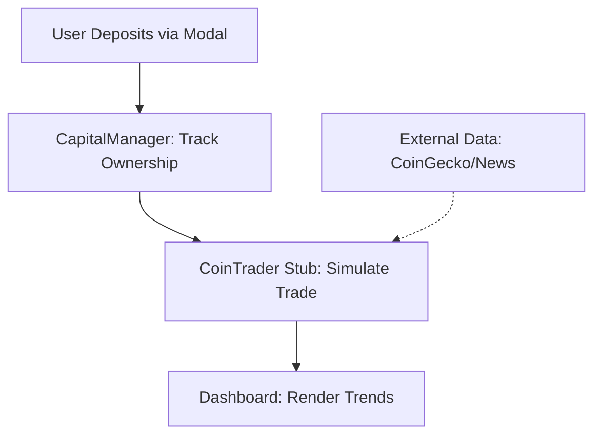

# QuantumPool Demo

[](https://opensource.org/licenses/MIT)
[](https://www.python.org/)
[](https://nextjs.org/)
[](https://fastapi.tiangolo.com/)

## 🚀 Introduction

**QuantumPool** is a decentralized, AI-powered cryptocurrency investment platform that democratizes access to sophisticated trading strategies. Built by [Dapp Mentors](https://dappmentors.org) (founded in 2022, with 5,500+ developers mentored across Ethereum, Solana, Alephium, and ICP), it enables users to pool capital into shared vehicles leveraging machine learning, sentiment analysis, and predictive modeling for multi-asset returns.

This **public demo repository** showcases the non-proprietary architecture, API specs, frontend components, and sample modules of QuantumPool. It demonstrates our technical foundation— including a responsive Next.js dashboard, FastAPI backend stubs, and MongoDB integration—without exposing core IP. For the full whitepaper, visit [trader.dappmentors.org/whitepaper](https://trader.dappmentors.org/whitepaper).

**Key Differentiators** (from our simulations):

- **AI-Driven Trading**: Multi-signal approach (EMA, RSI, MACD + Random Forest ML + LLM reasoning).
- **Transparent Pooling**: Proportional ownership with real-time analytics.
- **Risk Management**: ATR-based stops, volatility-adapted sizing.
- **Performance**: Simulated 57% return on ETH (Sep-Oct 2025) vs. -9% buy-and-hold; Sharpe 2.1.

Explore the live demo at [trader.dappmentors.org](https://trader.dappmentors.org). Seeking $1.5M for production scaling, compliance, and marketing—contact us to join!

## 📋 What's Included

This repo provides a blueprint for transparency:

- **Architecture Docs**: Diagrams and pseudocode for backend-frontend flows (e.g., CapitalManager ledger).
- **API Specs**: OpenAPI YAML for endpoints like `/coin/top_coins` and `/investment/deposit`.
- **Sample Modules**: Stubbed FastAPI services (e.g., `coin_stats.py` for volatility calcs) and React components (e.g., `ProfitTrendChart.tsx`).
- **Frontend Demo**: Basic Next.js app with dashboard, modals, and charts (using Recharts/Tailwind).
- **Deployment Tools**: Dockerfiles and GitHub Actions for CI/CD.

Run it locally: See [Setup](#setup) below.

## 🔒 Proprietary Code - Not Included

This directory contains proprietary trading algorithms and machine learning models that are core to QuantumPool's competitive advantage.

### What's Excluded

This folder would typically contain:

- AI-powered trading decision engine (e.g., CoinTrader lifecycle: Data → Analysis → Execution).
- Machine learning model training and prediction (e.g., Random Forest on 80/20 splits).
- News sentiment analysis algorithms (e.g., NLP via NLTK/Ollama).
- Risk management and position sizing logic (e.g., `Position Size = Capital × Signal × Volatility Adj.`).
- Automated execution strategies (e.g., tiered profit-taking, cool-down periods).

### Why It's Excluded

To protect intellectual property while seeking investment, the proprietary trading algorithms are not included in this public repository.

### For Investors

Investors interested in reviewing the complete codebase can request access by:

1. Signing a Non-Disclosure Agreement (NDA).
2. Contacting us at: [contact@dappmentors.org](mailto:contact@dappmentors.org).
3. Subject line: "Investment Code Review Request".

We provide:

- Private repository access under NDA.
- Live code walkthrough sessions.
- Technical due diligence meetings.
- Code escrow arrangements.

## 🛠️ Setup & Quick Start

### Prerequisites

- Node.js 18+ (for frontend).
- Python 3.11+ (for backend stubs).
- Docker & Docker Compose (recommended for full stack).

### Installation

1. Clone the repo:

   ```bash
   git clone https://github.com/yourusername/quantumpool-demo.git
   cd quantumpool-demo
   ```

2. Backend (stubs only):

   ```bash
   cd backend
   pip install -r requirements.txt  # Includes FastAPI, MongoDB stubs
   python run_dev.py  # Starts API at http://localhost:8000
   ```

3. Frontend:

   ```bash
   cd frontend
   npm install
   npm run dev  # Starts at http://localhost:3000
   ```

4. Full Stack (Docker):
   ```bash
   docker-compose up -d
   ```
   Access dashboard at `http://localhost:3000/dashboard`.

Test API: Use the included Postman collection or curl:

```bash
curl -X GET "http://localhost:8000/coin/top_coins?limit=5"
```

## ✨ Key Features (Demo Highlights)

- **Real-Time Dashboard**: Portfolio overview with investment cards and profit trends (sanitized data).
- **User Auth**: Google OAuth integration via `GoogleSignInButton.tsx`.
- **Investment Flows**: Mock deposit/withdrawal modals calculating ownership % = (Net Investment / Total Net) × 100.
- **Analytics Stubs**: Sample volatility charts (e.g., ATR formula: `Stop Loss = Entry - (ATR × 2)`).
- **Scheduler Demo**: YAML workflow for automated tasks (e.g., daily coin extraction).

For production features like full ML backtesting (e.g., 19-59% returns across ETH/BNB/SOL), see private access.

## 🏗️ Architecture Overview

QuantumPool uses a full-stack setup:

- **Backend**: FastAPI (Python) with MongoDB for user/investment tracking; APScheduler for jobs.
- **Frontend**: Next.js/React (TypeScript) with Tailwind CSS and Recharts for visuals.
- **Data Flow**: REST APIs → Real-time updates via WebSockets (planned); Docker for scalability.



See `docs/architecture.md` for full diagrams (e.g., MongoDB schema: Users, Trading State, Profit Snapshots).

## 📊 Quick Stats

- 📁 **62 files** across 22 directories
- 💻 **56 code files** in 4 programming languages
- 🚀 **Languages:** CSS, Python, TypeScript, JavaScript
- 📦 **Size:** 394,258 bytes

## 🌳 Project Structure

```
├─ .github/
│  └─ workflows/
│     └─ main.yml  # CI/CD for deployment
├─ backend/
│  ├─ app/
│  │  ├─ coin/          # Coin models & stubs
│  │  ├─ services/      # File/MongoDB handlers
│  │  └─ users/         # User CRUD
│  ├─ requirements.txt  # Python deps
│  └─ run_dev.py        # Dev server
├─ frontend/
│  ├─ app/              # Pages: dashboard, whitepaper
│  ├─ components/       # UI: Modals, Charts
│  ├─ contexts/         # Auth/Global state
│  └─ utils/            # API interfaces
└─ docker-compose.yml   # Stack orchestration
```

## 📋 All Files and Directories

(For brevity, see full tree above. Key highlights:)

- **`.github/workflows/main.yml`**: Deploys to VPS on push (YAML snippet below).
- **`backend/app/services/mongodb_service.py`**: DB interactions (stubbed).
- **`frontend/components/ProfitTrendChart.tsx`**: Visualizes gains (Recharts).
- **`frontend/app/dashboard/page.tsx`**: Core user view.

Example YAML from CI/CD:

```yaml
name: Deploy to VPS
on:
  push:
    branches: [main]
jobs:
  deploy:
    runs-on: ubuntu-latest
    steps:
      - uses: actions/checkout@v3
      - name: Deploy via SSH
        uses: appleboy/ssh-action@v0.1.3
        with:
          host: ${{ secrets.SSH_HOST }}
          # ... (sanitized)
```

## 🤝 Team & Roadmap

- **Darlington Gospel** (CEO, Dapp Mentors): Backend/AI lead ([LinkedIn](https://www.linkedin.com/in/darlington-gospel/)).
- **Ebenezer Enietan** (Backend): Solidity/dApp expert.
- **Bahiru Mulugeta** (Frontend): UI/UX specialist.

**Roadmap** (from whitepaper):

- **Q4 2025**: Enhanced UX, mobile alerts.
- **Q1 2026**: KYC/AML, API access.
- **Q2+ 2026**: Smart contracts, QPOOL token.

## 📈 Economic Model (Teaser)

- Fees: 0.05% trading/withdrawal; 15% performance above 10% benchmark.
- Projections: Break-even at 1,000 users/$7.5M TVL (conservative: $75K revenue Y1).

Full details in whitepaper Appendix.

## 📬 Contact & Contribute

- Website: [trader.dappmentors.org](https://trader.dappmentors.org)
- Email: [contact@dappmentors.org](mailto:contact@dappmentors.org)
- X: [@DappMentors](https://x.com/DappMentors)

Contributions welcome for docs/bug fixes (non-core). Star/fork for support!

**Copyright © 2025 Dapp Mentors. All Rights Reserved.**  
_Generated Oct 17, 2025. License: MIT (core proprietary)._  
_This README was enhanced with insights from ProjectAnalyzer._ ✨
